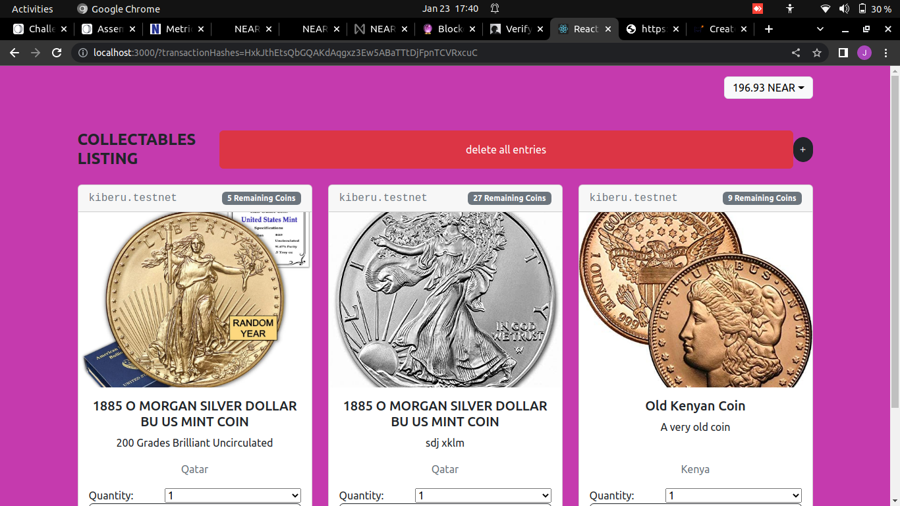

# Collectables

Being able to coplete transaction conpletely without needing to trust third parties comes in handy while purchasing old collectable items. Collectable application comes in handy by ensuring privacy and lack of censorship while buying your favorite old coins.

This is a front end application that consumes [collactable-contract](https://github.com/kiberuJ/collectables-contract) smart contract build using near protocol.

The live version can be found [here](https://kiberuj.github.io/Collectables/).

## :package: Built With

    - React.js
    - react-hooks
    - react-bootstrap
    - react-toastify

## :computer: Getting Started

    To get a local copy up and running follow these simple steps.

## :arrow_heading_down: Install

1. Clone the repository to your local machine

```sh
$ git clone git@github.com:kiberuJ/Collectables.git
```

2. cd into the directory

```sh
$ cd Collectables
```

3. install dependencies

```sh
npm install
```

or if you are using yarn:

```sh
yarn install
```

Start the development server

```sh
npm start
```

or with yarn:

```sh
yarn start
```

## :arrow_forward: Usage

You will be redirected to `localhost:3000` after starting the development server.
On the home page, you can view all the listing as well as perform create, delete, and purchase coin listing.

<p align="center">
<a href="#">
    
  </a>
</p>

## :busts_in_silhouette: Authors

👤 **Jane Kiberu**

- Github: [@KiberuJ](https://github.com/kiberuJ)

## 🤝 Contributing

    Contributions, issues and feature requests are welcome!

Feel free to check the [issues page](../../issues).

## :star2: Show your support

    Give a ⭐️ if you like this project!
